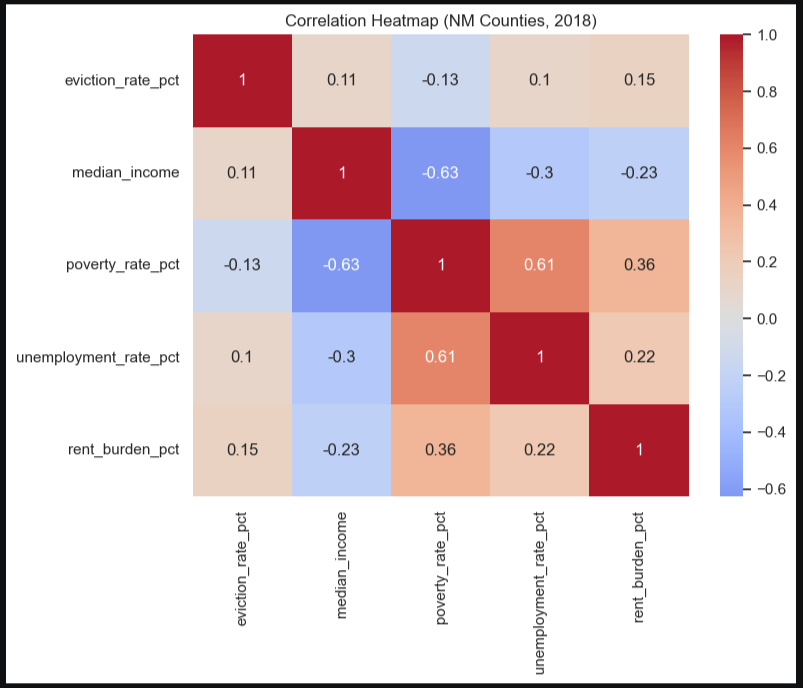
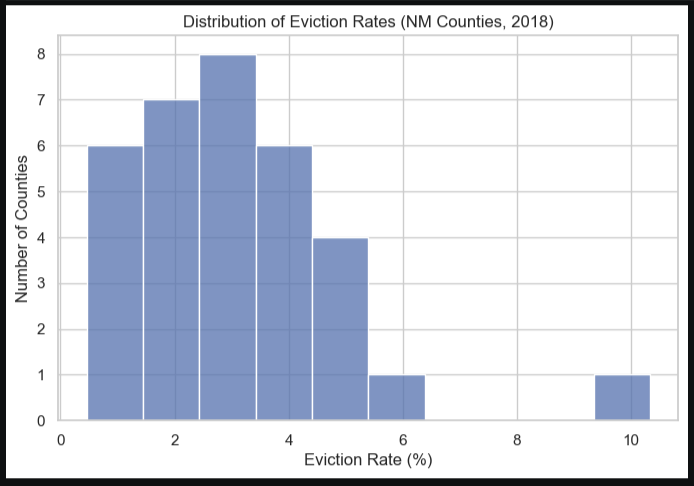
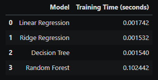
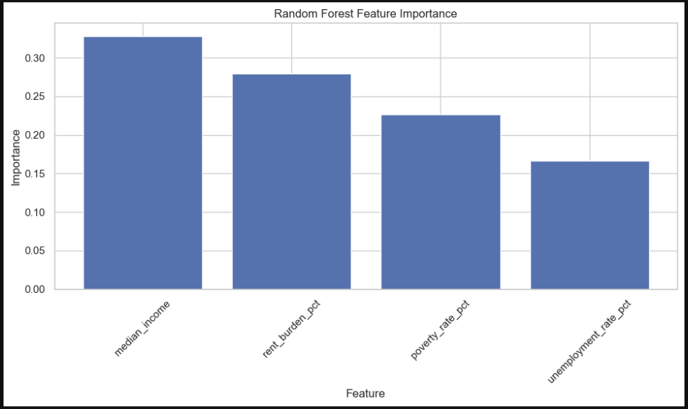

# Eviction Risk Prediction Using Machine Learning

## Project Overview

This project analyzes eviction risk patterns using machine learning techniques and socioeconomic datasets related to housing instability, poverty, unemployment, and rental burden. The analysis focuses on identifying factors associated with elevated eviction risk across counties in New Mexico while demonstrating a complete data analytics workflow including preprocessing, exploratory analysis, predictive modeling, and evaluation.

As team leader for this project, I coordinated the analytical workflow, contributed to model development and exploratory analysis, and helped guide the final reporting and interpretation of results.

## Business Problem

Housing instability and eviction risk remain significant social and economic challenges across many communities. This project was designed to examine how demographic and economic indicators may influence eviction patterns and to develop predictive models capable of identifying regions at higher risk of housing insecurity.

## Tools & Technologies

- Python
- Pandas & NumPy
- Scikit-learn
- Jupyter Notebook
- Matplotlib & Seaborn
- Machine Learning
- Exploratory Data Analysis (EDA)
- Classification Modeling
- Correlation Analysis
- Public Socioeconomic Datasets

## Machine Learning Models

The following machine learning models and analytical approaches were explored throughout the project:

- Logistic Regression
- Random Forest Classification
- Correlation Heatmaps
- Feature Engineering
- Data Cleaning & Preprocessing
- Exploratory Data Analysis

## Key Areas of Analysis

- Housing instability trends
- Poverty and unemployment relationships
- Rental burden analysis
- County-level eviction risk patterns
- Socioeconomic feature analysis
- Predictive modeling performance
- Data preprocessing and integration

## Key Insights

- Economic instability indicators showed measurable relationships with eviction risk.
- Poverty rate and rent burden were among the strongest contributing factors.
- Machine learning models demonstrated the ability to identify high-risk regions based on socioeconomic variables.
- Data visualization techniques helped reveal county-level patterns and regional disparities.

## Visualizations & Insights

### Correlation Heatmap
Shows relationships between eviction rates and socioeconomic indicators across New Mexico counties. The analysis revealed moderate relationships between poverty, unemployment, and rental burden, while eviction rate itself showed weaker direct correlations with individual predictors.



### Eviction Rate Distribution
Displays the distribution of county-level eviction rates across New Mexico in 2018. Most counties experienced relatively low-to-moderate eviction rates, while a small number of counties showed significantly higher housing instability.



### Model Comparison by R²
Compares predictive performance across multiple machine learning models including Linear Regression, Ridge Regression, Decision Tree, and Random Forest. Results demonstrated that eviction prediction is a complex problem with limited predictive power using only socioeconomic variables.


### Model Training Time Comparison
Highlights computational efficiency across the evaluated models. While Random Forest required more processing time than linear models, all models trained quickly due to the relatively small dataset size.



### Random Forest Feature Importance
Illustrates the relative importance of socioeconomic variables used in eviction risk prediction. Median income and rent burden emerged as the strongest contributing predictors in the Random Forest model.



## Repository Structure

```text
images/              -> Charts, heatmaps, and visualizations
notebooks/           -> Jupyter notebooks and ML workflows
report/              -> Final reports and documentation
```

## Future Improvements

Future versions of this project could incorporate:

- Additional demographic datasets
- Geographic clustering analysis
- Time-series forecasting
- Advanced ensemble modeling
- Interactive dashboards using Tableau or Power BI

## Author

Cruz Lawrence-Mayes  
M.S. Data Analytics
